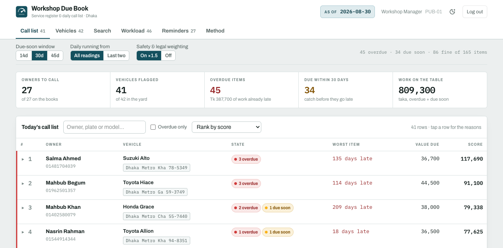

# Workshop Due Book

**The cars that are due, in the order to ring them.**

A service due predictor for a car servicing workshop in Dhaka. It works out what
is due on every vehicle from that vehicle's own paperwork and its own odometer,
ranks who to call today by the money at risk, and records the work when it is
done.



Built for LSH26 (team `LSH26-T027`, problem `P09`).

---

## The problem

The workshop looks after a few hundred customer vehicles. Every vehicle has
parts with their own service life:

- **Fixed date** — insurance, fitness certificate, tax token, battery warranty
- **Time based** — engine oil, air filter, coolant, AC service
- **Distance based** — brake pads, spark plugs, tyres, timing belt

Today that lives in a register book and the manager's head, so the workshop
finds out something was due when the customer arrives with a problem. A car that
runs 80 km a day wears its brake pads out in a third of the time one that runs
18 km a day does — a single fixed interval for the whole fleet is wrong for
almost every car in it.

## What it does

**Required**

- **Due prediction for every item**, by its own rule. Distance items are
  projected from **that vehicle's** km/day, taken from its odometer history.
  Each item is classified `overdue` / `due soon` / `fine`, with a plain-English
  reason for the date.
- **A ranked daily call list** — owner, phone, vehicle, what is due and why —
  sorted by `Σ cost × urgency × safety weight`, with the arithmetic printed on
  every row so any position is defensible.
- **A vehicle page** showing every item, its next due date and cost, where the
  workshop records a completed service. Exactly one item resets, the history
  grows, and the screen names the item whose date moved and counts the ones that
  did not.
- **Fleet data** — 25 workshops, 1,052 vehicles, 677 owners, 4,197 service items.

**Beyond the brief**

- **8-week workload preview**, with the overdue backlog kept separate so a week
  is not misread. Click a week to read its jobs.
- **New odometer reading** — every distance estimate recomputes, and the app
  names the km/day change and each estimate that moved.
- **Copy-ready reminder per owner**, merged across their cars, with a WhatsApp
  deep link.
- **Next-visit prediction** — a random forest over 1,549 observed inter-visit
  gaps says when the customer will actually turn up, which is a different
  question from when work is due. 41.5 days MAE against a 62.5-day baseline,
  validated leave-one-workshop-out.
- **Method tab** — every number on screen, derived, with a worked example.
- **Walk-in intake**, catalogue-driven service fitting, search across name,
  phone, plate, model and id, and multi-user auth with each account pinned to
  one workshop.

## Quick start

```bash
cp .env.example .env      # set DATABASE_URL and AUTH_SECRET (≥32 chars)
npm install
npm run db:generate
npm run db:push
npm run dev               # http://localhost:3000
```

Register at `/register`, then assign the account a workshop —
`UPDATE "User" SET "caseId" = 'PUB-02' WHERE email = '…'`. There is no admin UI
yet, and a new account will tell you it has no workshop rather than showing you
someone else's. Avoid `PUB-01`: it is the pinned fixture the self-check asserts
against.

### Answer a case with no browser and no database

`POST /api/run` is stateless and unauthenticated: a whole case in, answers out.

```bash
curl -X POST http://localhost:3000/api/run \
  -H 'content-type: application/json' -d @src/data/case-pub-01.json
```

The same answers, offline:

```bash
npm run cases -- src/data/case-pub-01.json
```

Both go through the same `buildAnswers()`, so they cannot disagree.

## How it works

Four invariants hold the whole thing up:

1. **`today` is a field on the case, never the system clock** — so every result
   is deterministic and reproducible.
2. **Distance items use that vehicle's own km/day**, from its own odometer span.
3. **Recording a service resets exactly one item** — the reset falls out of
   recomputation, not mutation.
4. **The call list is ranked by a published formula**, printed per row.

All domain calculation lives in one pure, I/O-free module,
[`src/lib/engine.ts`](src/lib/engine.ts). PostgreSQL stores the same shape and
[`src/lib/case-db.ts`](src/lib/case-db.ts) serialises it back byte-identical to
the published fixture, so the engine, the UI and the self-check run unchanged
over either source.

A separate, optional Python model predicts when an owner will actually turn up.
It is treated as an optimisation, not a dependency: `/api/visit` falls back to a
committed lookup table whenever the model service is unreachable, and says which
one answered.

## Documentation

Module-by-module documentation lives in [`docs/`](docs/README.md).

|                                                    |                                                               |
| -------------------------------------------------- | ------------------------------------------------------------- |
| [Architecture](docs/architecture.md)               | Layers, request flow, the invariants                          |
| [Domain engine](docs/domain-engine.md)             | Due rules, statuses, km/day, ranking, mutations               |
| [Data model](docs/data-model.md)                   | Prisma schema, case assembly, the Zod contract, the catalogue |
| [API reference](docs/api-reference.md)             | Every route and Server Action                                 |
| [Auth](docs/auth.md)                               | Sessions, hashing, route gating, workshop scoping             |
| [UI](docs/ui.md)                                   | The dashboard, its view model and data flow                   |
| [ML — visit predictor](docs/ml-visit-predictor.md) | The models, the service, the offline fallback                 |
| [Verification](docs/verification.md)               | Self-checks, the CLI runner, lint and build                   |
| [Operations](docs/operations.md)                   | Environment, scripts, runbooks, limitations                   |
| [Glossary](docs/glossary.md)                       | Case, visit, drift, hazard, and the rest                      |

## Scripts

| Command                                         | Does                                                |
| ----------------------------------------------- | --------------------------------------------------- |
| `npm run dev` / `build` / `start`               | Development server / production build / serve       |
| `npm run lint` / `format`                       | Biome                                               |
| `npm run db:generate` / `db:push` / `db:studio` | Prisma                                              |
| `npm run cases -- <file>`                       | Answers for case files, offline                     |
| `npm run ml:export`                             | Database → `ml/cases.json`                          |
| `npm run ml`                                    | Retrain the visit predictor                         |
| `npm run ml:serve`                              | The prediction service on 127.0.0.1:8010            |
| `npm run check:visit`                           | Assert the bundled model and the live service agree |
| `npx tsx src/lib/engine-check.ts`               | The domain self-check                               |

## Verification

```bash
npx tsx src/lib/engine-check.ts   # the documented PUB-01 answers, from the
                                  # fixture AND from the database
npm run check:visit               # the model's silent-wrong-answer bugs
npx tsc --noEmit && npm run lint && npm run build
```

`engine-check.ts` asserts the exact published answers — the top six call-list
rows, the 45-job / ৳387,700 backlog, all eight weekly buckets — so drift in the
persistence layer surfaces as a wrong number rather than a subtly wrong order.
Details in [docs/verification.md](docs/verification.md).

## Tech stack

Next.js 16 (App Router) · React 19 · TypeScript · PostgreSQL via Prisma 7 ·
Zod 4 · Tailwind CSS 4 · shadcn/ui over Base UI · TanStack Query · jose +
argon2 · scikit-learn + FastAPI for the model · Biome.

## Project structure

```
src/lib/engine.ts        the domain — pure, no I/O, no clock
src/lib/case-schema.ts   the Zod trust boundary
src/lib/case-db.ts       Postgres <-> the one shape
src/lib/visit.ts         when the customer actually turns up
src/app/api/             seven thin routes
src/components/due-book/ the dashboard
ml/                      the Python trainer and prediction service
docs/                    module documentation
plans/                   feature list and planning notes
```

## Limitations

Stated plainly rather than hidden:

- The database cannot be rebuilt from a clone — the public data drop is not
  committed and there is no seed script.
- No edit or delete for customers, vehicles or items, and no onboarding for a
  brand-new empty workshop.
- Verification is `assert`-based self-checks run manually, not a framework suite
  in CI.
- The visit model's 80% window is roughly ±65 days, and predictions are clamped
  to today rather than fitted with a full survival model.

The full list, with context, is in
[docs/operations.md](docs/operations.md#known-limitations).

## Licenses

Third-party licenses are listed in [LICENSES.md](LICENSES.md). The team's own
source has no license chosen yet.
